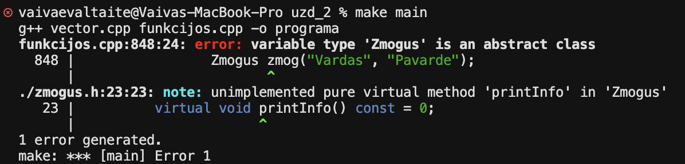
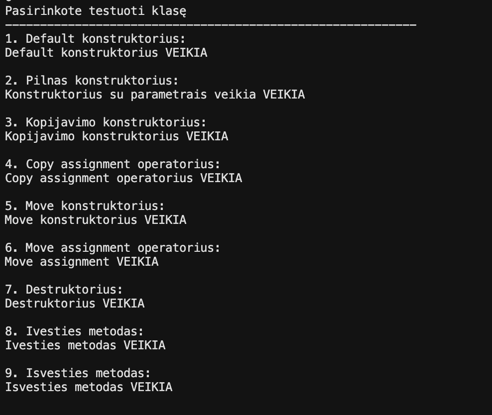
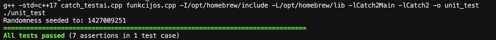

# Antras_Laboratorinis
# Programos aprašymas

Ši programa yra skirta apdoroti studentų duomenis ir jų akedeminius pasiekimus.
**Pagrindinės programos funkcijos**
* 1. Įvesti visus studento duomenis ranka;
* 2. Sugeneruoti atsitiktinius pažymius, bet studento vardą ir pavardę įvesti ranka;
* 3. Sudenetuoti studento vardą, pavardę ir pažymius;
* 4. Nuskaityti duomenis iš failo;
* 5. Testuoti programą;

Taip pat programoje yra trys strategijos, kurios skirtos parodyti kaip kinta programos veikimo laikas nuo naudojamų konteinerių (vector, list, deque) duomenų skirstymo į dvi grupes (pažangių ir nepažangių) metu.

Pirmoje strategijoje skirstymas vyksta į du to paties tipo konteinerius, antrosios strategijos metu sukuriamas tik vienas papildomas konteineris ir į jį perkeliami nepažangūs mokiniai, o pažangūs lieka pradiniame. Trečioji strategija yra optimizuota antroji strategija naudojant Standard Template Library (STL)

Atlikus tyrimus galime pamatyti, jog greičiausia yra trečioji trategija, naudojant vector.

<h2>Naudojimosi instrukcija</h2>
<ol>
    <li>Susiinstaliuoti <b>make</b> (Windows naudotojams rekomenduojama per <a href="https://gnuwin32.sourceforge.net/packages/make.htm">GNUWin32</a>)</li>
    <li>Atsidaryti terminalą</li>
    <li>Klonuoti programos repozitoriją:
        <pre><code>git clone https://github.com/vaivaeva201/objektinis_programavimas_2</code></pre>
    </li>
    <li><b>Užeiti į projekto aplanką:</b>
        <pre><code>cd objektinis_programavimas_1</code></pre>
    </li>
    <li>Paleisti norimą funkciją:
        <ul>
            <li><pre><code>make main</code></pre> - pagrindinė programa</li>
            <li><pre><code>make run0</code></pre> - pradinio tyrimo paleidimas</li>
            <li><pre><code>make run1</code></pre> - 1 strategijos testavimas</li>
            <li><pre><code>make run2</code></pre> - 2 strategijos testavimas</li>
            <li><pre><code>make run3</code></pre> - 3 strategijos testavimas</li>
            <li><pre><code>make unit</code></pre> - unit testai</li>
        </ul>
    </li>
</ol>

# Versija - v1.1

Šakoje v1.1 lyginome "class" ir "struct" naudojimą apdorojant studentų duomenis. v1.1 versija pritaikyta "class" ir buvo lyginama su v1.0 versijos "struct". Buvo naudojamas vektor konteineris su 3 strategija. Pateikti rezultatai yra trijų iteracijų vidurkis.

| Tipas | Failo dydis | Optiizavimo vėliava | .exe failo dydis | Programos veilimo laikas |
| :--- | :--- | :--- | :--- | :--- |
| CLASS | 100000 | - | 239K | 2.48582 s |
| CLASS | 1000000 | - | 239K | 25.032 s |
| STRUCT |  100000 | - | 238K | 1.93843 s |
| STRUCT |  1000000 | - | 238K | 19.6844 s |
| CLASS | 100000 | -O1 | 121K | 0.84203 s |
| CLASS | 1000000 | - O1 | 121K | 8.11251 s |
| STRUCT |  100000 | -O1 | 120K | 0.714521 s |
| STRUCT |  1000000 | -O1 | 120K | 7.23889 s |
| CLASS | 100000 | -O2 | 121K | 0.816232 s |
| CLASS | 1000000 | -O2 | 121K | 7.9286 s |
| STRUCT |  100000 | -O2 | 120K | 0.672481 s |
| STRUCT |  1000000 | -O2 | 120K | 6.98227 s |
| CLASS | 100000 | -O3 | 121K | 0.792985 s |
| CLASS | 1000000 | -O3 | 121K | 7.81915 s |
| STRUCT |  100000 | -O3 | 120K | 0.668681 s |
| STRUCT |  1000000 | -O3 | 120K | 6.9911 s |

# Versija - v1.2

Šioje versijoje klasė 'Studentas' buvo patobulinta pritaikant "Rule of Five" ir perdengtus išvesties ir ėvesties metodus.

### **Naudoti metodai ir jų paskirtys**
#### **Rule of Five**
* Kopijavimo konstruktorius - sukuria tikslią egziztuojančio objekto reikšmių kopiją;
* Kopijavimo priskyrimo operatorius - jau inicializuotam objektui priskiriama nauja reikšmė iš kito egzistuojančio objekto;
* Move konstruktorius - perkelia vieno objekto reikšmes į kitą objektą ir ištriną pirmajį objektą;
* Move priskyrimo operatorius - perkialia vieno objekto reikšmes į jau inicializuotą default objektą ir ištrina pirmojo objektą.
* Destruktorius - atsakingas už objektui priskirtų reikšmių išvalymą;
#### **Perdengti įvesties ir išvesties metodai**
* Įvesties operatorius - leidžia nuskaityti vieno studento visus duomenis tiesiai iš pasirinkto srauto;
* Išvesties operatorius - leidžia į pasirinktą srautą išvesti vieno studento duomenis;

# Versija - v1.5

Šioje versijoje pridėt nauja klasė 'Zmogus', ši klasė yra abstrakti. Dabar klasė 'Studentas' paveldi klasę 'Zmogus', atitinkamai pakeisti konstruktoriai ir destruktorius.

Kadandi klasė 'Zmogus' yra abstrakti negalima sukurti tokio tipo objekto:

* Patikrinti klases buvo naudoti tie patys testai kaip ir v1.2 versijoje:

# Versija - v2.0

v2.0 versijoje sukurta dokumentacija ir atlikti Unit testai. Sukurti testam buvo naudojama Catch2 testavimo framework. 

# Kompiuterio charakteristikos

**Testuojamos sistemos parametrai**
| Parametras | Reikšmė |
| --------------------- | --------------------- |
| CPU | Apple M1, 8 core |
| RAM | 8 GB | 
| SSD | 256 GB |