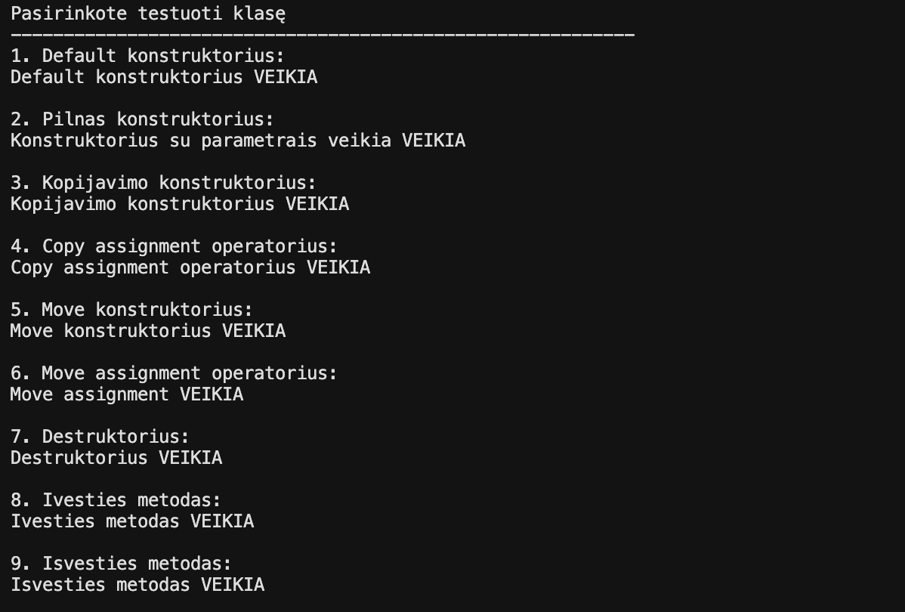

# Antras_Laboratorinis
# v1.2

Šioje versijoje klasė 'Studentas' buvo patobulinta pritaikant "Rule of Five" ir perdengtus išvesties ir ėvesties metodus.

**Naudoti metodai ir jų paskirtys**
**Rule of Five**
Kopijavimo konstruktorius - sukuria tikslią egziztuojančio objekto reikšmių kopiją;
Kopijavimo priskyrimo operatorius - jau inicializuotam objektui priskiriama nauja reikšmė iš kito egzistuojančio objekto;
Move konstruktorius - perkelia vieno objekto reikšmes į kitą objektą ir ištriną pirmajį objektą;
Move priskyrimo operatorius - perkialia vieno objekto reikšmes į jau inicializuotą default objektą ir ištrina pirmojo objektą.
Destruktorius - atsakingas už objektui priskirtų reikšmių išvalymą;
**Perdengti įvesties ir išvesties metodai**
Įvesties operatorius - leidžia nuskaityti vieno studento visus duomenis tiesiai iš pasirinkto srauto;
Išvesties operatorius - leidžia į pasirinktą srautą išvesti vieno studento duomenis;

**"Class" ir "Struct" tyrimas**

Galime patebėti, jog pritaikius 'Rule of Five' ir perdengtus metobus CLASS greičiau atlieka duomenu nuskaitymo ir priskyrimo operacijas.

| Tipas | Failo dydis | Optiizavimo vėliava | .exe failo dydis | Programos veilimo laikas |
| :--- | :--- | :--- | :--- | :--- |
| CLASS | 100000 | - | 257K | 1.68745 s |
| CLASS | 1000000 | - | 257K | 17.0306 s |
| STRUCT |  100000 | - | 238K | 1.93843 s |
| STRUCT |  1000000 | - | 238K | 19.6844 s |
| CLASS | 100000 | -O1 | 136K | 0.582763 s |
| CLASS | 1000000 | - O1 | 136K | 5.99084 s |
| STRUCT |  100000 | -O1 | 120K | 0.714521 s |
| STRUCT |  1000000 | -O1 | 120K | 7.23889 s |
| CLASS | 100000 | -O2 | 138K | 0.55728 s |
| CLASS | 1000000 | -O2 | 138K  | 5.75132 s |
| STRUCT |  100000 | -O2 | 120K | 0.672481 s |
| STRUCT |  1000000 | -O2 | 120K | 6.98227 s |
| CLASS | 100000 | -O3 | 138K | 0.598396 s |
| CLASS | 1000000 | -O3 | 138K | 5.82615 s |
| STRUCT |  100000 | -O3 | 120K | 0.668681 s |
| STRUCT |  1000000 | -O3 | 120K | 6.9911 s |

